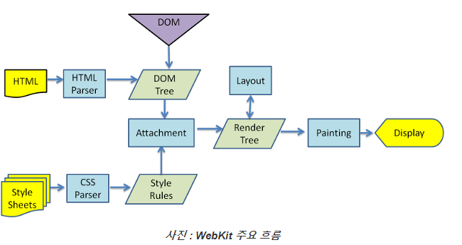

## Chap1(웹 프로그래밍 기초) 정리

### Browser의 동작
- 웹을 통해서 전달되는 데이터는 어딘가에서 해석돼야 합니다. 
서버에서 전송한 데이터(HTML과 같은)가 클라이언트에 도착해야 할 곳은 'Browser'입니다.
Browser에는 *데이터를 해석*해주는 *파서*와 *데이터를 화면에 표현*해주는 *렌더링엔진*이 포함되어 있습니다.

[브라우저 동작 정리 링크](https://www.html5rocks.com/en/tutorials/internals/howbrowserswork/#Introduction)

렌더링 엔진
- 브라우저마다 다른 렌더링 엔진을 사용합니다. Internet Explorer는 Trident를, Firefox는 Gecko를, Safari는 WebKit을 사용합니다. 
Chrome 및 Opera (버전 15부터)는 WebKit의 포크 인 Blink를 사용합니다.
- WebKit은 Linux 플랫폼 용 엔진으로 시작하여 Mac과 Windows를 지원하도록 Apple에서 수정 한 오픈 소스 렌더링 엔진입니다.

렌더링 엔진은 네트워크 계층에서 요청된 문서의 내용을 가져온다. 보통 8kb 청크 파일로 이루어진다.

Webkit 메인 플로우
 

생각해보기
1. 우리가 흔히 브라우저 탐색을 할 때 스크롤을 하거나, 어떤 것을 클릭하면서 화면의 위치를 바꿀 때, 브라우저는 어떻게 다시 화면을 그릴까요?
위에서 표현된 그림처럼 다시 렌더링 되지 않을까요? 

답변: 브라우저를 스크롤링하거나 링크를 클릭하는 등의 동작을 진행할 때, 브라우저는 Web Page의 구성 요소인
Render Tree를 저장하고 있다가 정보만 가져와서 painting 작업을 진행한다. 따라서 다시 렌더링되지 않는다.

### 웹 서버

- 웹 서버는 소프트웨어를 보통 말하지만, 웹 서버 소프트웨어가 동작하는 컴퓨터를 말한다.
- 웹 서버의 가장 중요한 기능은 클라이언트(브라우저)가 요청하는 HTML 문서가 각종 리소스를 전달하는 것이다.
- 웹 브라우저나 웹 크롤러가 요청하는 리소스는 컴퓨터에 저장되어 있는 정적인 데이터이거나 서버 애플리케이션을 통한
동적인 결과가 도리 수 있다.

이때, 네이버나 구글은 웹 크롤러 소프트웨어를 사용해서 다른 웹 사이트의 정보들을 긁어서 DB에 저장한 다음, 검색 결과에 맞춰서
사용자가 원하는 정보들을 보여준다.

생각해보기
1. 네이버, 구글과 같은 검색을 할 수 있는 사이트에서는 검색어를 입력하면 검색어가 포함된 웹 페이지 목록을 보여줍니다.
네이버와 구글은 검색어가 포함된 웹페이지를 어떻게 알 수 있었을까요?

답변: 
웹 크롤러가 ⇒ 주소별로 웹 크롤링( 페이지의 리소스가 업데이트되는 주기가 빠르므로 매우 자주 이터레이팅함 ) ⇒ 리소스들을 주소별로 검토 ⇒ 
검색어가 언급된 횟수 + page rank 알고리즘을 사용해 리소스기준 a tag href = "" 를 다른 사이트에서 많이 받고
 영향력있는 웹사이트로 부터 받은 인기를 기준으로 랭크 매김(기준은 인더스트리적 필요에 따라 계속적으로 바뀐다고 함) ⇒ 해당 쿼리가 발생시 ⇒ 위 랭크에 맞게 링크와 리소스 일부를 렌더링
 
참고 자료: [구글의 검색 작동 방식](https://www.google.com/intl/ko/search/howsearchworks/)

### WAS

클라이언트/서버 구조
- 클라이언트는 서비스를 제공하는 서버에게 정보를 요청하여 응답 받은 결과를 사용한다.

미들웨어
- 클라이언트 쪽에 비즈니스 로직이 많을 경우, 클라이언트 관리(배포 등)로 인해 비용이 많이 발생하는 문제가 있다.
비즈니스 로직을 클라이언트와 DBMS사이의 미들웨어 서버에서 동작하도록 함으로써 클라이언트는 입력과 출력만 담당하도록 한다.

WAS(Web Application Server)
- WAS는 일종의 미들웨어로 웹 클라이언트(브라우저)의 요청 중 웹 애플리케이션이 동작하도록 지원하는 목적을 가진다.

웹 서버 vs WAS
- WAS도 보통 자체적으로 웹 서버 기능을 내장하고 있다.
- 현재는 WAS가 가지고 있는 웹 서버도 정적인 콘텐츠를 처리하는 데 있어서 성능상 큰 차이가 없다.
- 규모가 커질수록 웹 서버와 WAS를 분리한다.
- 자원 이용의 효율성 및 장애 극복, 배포 및 유지보수의 편의성을 위해 웹서버와 WAS를 대체로 분리한다.
- 보통은 클라이언트 요청이 들어오면 Nginx 서버에서 정적인 리소스를 가져와서 브라우저에 렌더링 해주고, 그 다음에
웹 애플리케이션 서버에서 요청한 결과를 응답으로 보내준다. 이때 캐싱을 해서 보여줄 수도 있고, 그냥 보여줄 수도 있다.

### HTML class와 id 속성

ID
- 고유한 속성으로 한 HTML 문서에 하나만 사용 가능합니다.
- 고유한 ID 값이 있으면 하나하나에 특별한 제어를 할 수 있으며 검색에도 용이합니다.

CLASS
- 하나의 HTML문서 안에 중복해서 사용 가능합니다.
- 하나의 태그에 여러 개의 다른 class 이름을 공백을 기준으로 나열할 수가 있습니다.
- 홈페이지 전체적인 스타일을 일관성 있게 지정하기 위해서는 class의 사용이 필수적입니다.

참고글 : [CSS 방법론](https://wit.nts-corp.com/2015/04/16/3538)

### CSS inline, internal, external

우선순위
- inline은 별도의 우선순위를 갖지만, internal 과 external은 우선순위가 동등합니다. 따라서 겹치는 선언이 있을 경우 나중에 선언된 속성이 반영됩니다.

생각해보기
1. javascript로 동적으로 css코드를 수정하려고 하면 어떻게 해야 할까요? 나중에 차츰 알게 되지만, 미리 어떤 방법이 있을지 고민해보세요.

답변: id, class를 통해 접근하여 조작이 가능함.

### JDK,JRE

보통의 자바 애플리케이션은 JRE만으로도 가능하다.

하지만, 자바 애플리케이션을 개발하려면 JDK를 사용해야 한다.

JDK가 운영체제별로 설치파일을 제공하는 이유는 java 언어 자체가 플랫폼 독립적이며, 각각의 운영체제에 맞게 설치파일을
제공해야 각 운영체제에서 Java 언어로 작성된 프로그램을 실행할 수 있기 때문이다.

### 환경변수 설정

생각해보기
- JRE를 설치할 경우 환경변수를 설정할 필요가 없다.
- 하지만, JDK를 설치할 경우 환경변수를 설정해야 한다. 이유가 뭘까?

답변: 시스템(운영체제)에서 접근하기 위함이다. 우리가 환경변수를 설정하지 않게되면, javac, java와 같은 명령어들이 실행되지 않기 때문이다.

### Servlet 실행

생각해보기
- 어떤 과정을 거쳐서 브라우저에서 'Hello World'가 출력될까?

답변: Servlet의 라이프사이클은 [ 생성자 -> init() -> service() -> doGet or doPost -> destroy() ]로 되어 있습니다.
init() 다음 스레드를 생성하여 다양한 사용자들의 요청에 대응하고, 서비스는 사용자 요청이 get인지 post인지 판별해서 doGet or doPost로 보내게 됩니다.(default : get방식)
Servlet은 초기화를 init()에서 수행하게 되고 doGet과 doPost는 JSP의 작업을 구현해주어서 'Hello world'를 출력합니다.

### Servlet 라이프 사이클

- WAS는 서블릿 요청을 받으면 해당 서블릿이 메모리에 있는지 확인한다.

```java
if(메모리에 없다면) {
    - 해당 서블릿을 메모리에 올림
    - init()을 실행
}
- service()를 실행
```
- was가 종료되거나, 웹 어플리케이션이 새롭게 갱신될 경우 destroy() 메소드가 실행된다.

service(request, response) 메소드 (HttpServlet의 service 메소드는 템플릿 메소드 패턴으로 구현한다.)
- 클라이언트의 요청이 GET일 경우에는 자신이 가지고 있는 doGet(request, response)메소드를 호출
- 클라이언트의 요청이 Post일 경우에는 자신이 가지고 있는 doPost(request, response)를 호출

### HttpServletRequest, HttpServletResponse

웹 브라우저에 URL을 입력하고 enter를 입력하면, 웹 브라우저는 도메인과 포트 번호를 이용해서 서버에 접속한다.
그리고 나서 path 정보, 클라이언트의 IP, 클라이언트의 다양한 정보를 포함한 요청 정보를 서버에 전송한다.

클라이언트로부터 요청이 들어오면 WAS는 HttpServletRequest, HttpServletResponse를 생성한다. 그리고 요청할 때 가지고 들어온 다양한 정보들을
HttpServletRequest에 담는다. 

HttpServletRequest는 HTTP 프로토콜의 request 정보를 서블릿에게 전달할 목적으로 사용이 되어진다. 헤더 정보, 파라미터 정보, 쿠키, URL, URI 정보들을
요청할 때 메소드로 담는다. 또한 Request Body에 stream을 읽어들이는 메소드도 가지고 있다.

또한 HttpServletResponse를 생성해서 사용자에게 응답 코드와 메세지 등을 전송한다.