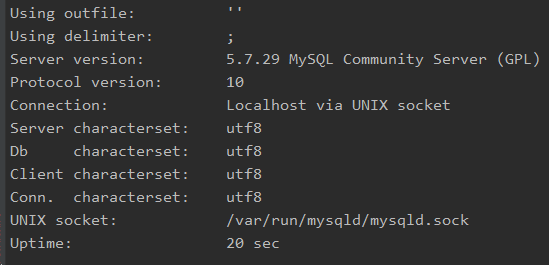

## Docker Mysql UTF8 셋팅.

mysql 셋팅 명령어

``docker run -p 3306:3306 -d --name 도커이름 -e MYSQL_ROOT_PASSWORD=패스워드 -e MYSQL_DATABASE=DB이름 mysql:버전 --character-set-server=utf8 --collation-server=utf8_general_ci``

ex)

``docker run -p 3306:3306 -d --name ticket -e MYSQL_ROOT_PASSWORD=pass -e MYSQL_DATABASE=ticket mysql:5.7 --character-set-server=utf8 --collation-server=utf8_general_ci``

이후 테이블 생성 전, utf8 client설정도 해주어야 한다.

먼저 bash로 들어간다. (start 명령어 생략)

``docker exec -i -t ticket bash`` 

my.cnf 설정을 위한 vim 추가.

````
apt-get update
apt-get install vim
vi /etc/mysql/my.cnf
````

my.cnf 파일에 아래와 같이 적어준다.

````
[client]
default-character-set=utf8

[mysql]
default-character-set=utf8
````

설정 후 컨테이너 재시작.
````
docker stop ticket
docker start ticket
````

이후 mysql로 들어가서, status 명령어를 실행하면!

아래와 같이 server와 client에 모두 utf8 설정이 적용된걸 확인할 수 있다.



